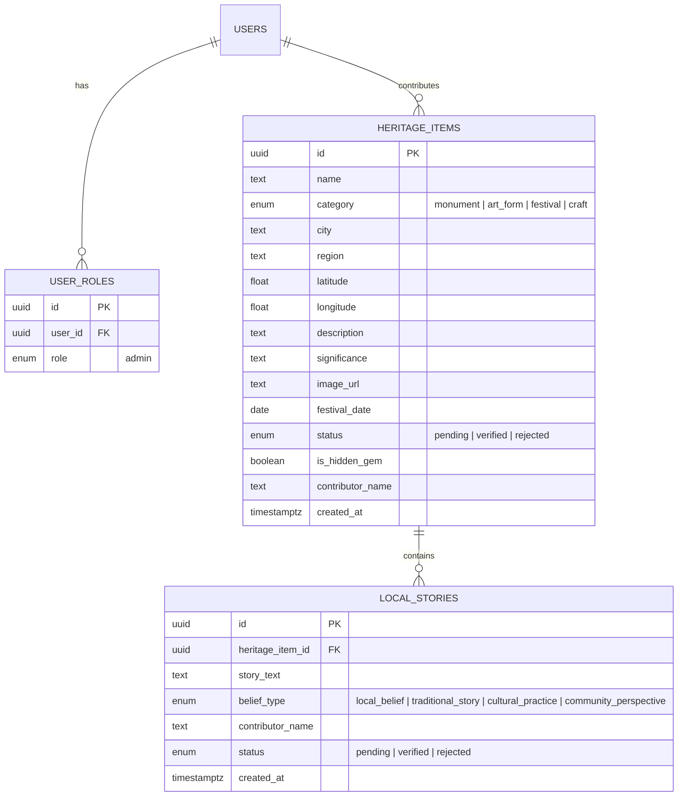

# Virasat Map — India's Living Heritage

[](https://react.dev/)
[](https://tanstack.com/start)
[](https://tailwindcss.com/)
[](https://supabase.com/)
[](https://www.typescriptlang.org/)
[](https://leafletjs.com/)
[](LICENSE)

> A modern, community-driven cultural heritage discovery platform for India. Explore ancient monuments, indigenous art forms, vibrant festivals, and traditional crafts on an interactive map, dynamically plan trips around live festival dates, and preserve oral folklore through AI-powered voice contributions.

---

## 🌐 Live Application

* **Production Site:** [https://virasatmap.lovable.app](https://virasatmap.lovable.app/)
* **Preview Deployment:** [https://id-preview--7a7909da-bf76-4e81-91d4-f50598f4ff04.lovable.app](https://id-preview--7a7909da-bf76-4e81-91d4-f50598f4ff04.lovable.app/)

---

## 🌟 Key Features

### 🗺️ Interactive Heritage Map
* **Pan & Zoom Across India:** Real-time geospatial mapping rendered with high performance.
* **Rich Pin Previews:** Hover or tap on pins to reveal high-resolution photography, heritage classification, location, region, and brief historical narratives.
* **Filter by Categories:** Instantly toggle between **Monuments**, **Art Forms**, **Festivals**, and **Traditional Crafts**.

### 🗓️ Smart Trip & Itinerary Planner
* **Date-Aware Scheduling:** Select your travel window to generate a day-by-day smart itinerary.
* **Festival Event Locking:** Automatically detects local festivals or cultural performances occurring during your trip and anchors them onto their specific occurrence dates.
* **Intelligent Routing:** Fills open days with nearby heritage sites, artisan clusters, and historical landmarks.

### 🎙️ AI Voice Dictation & Oral History
* **Multilingual Voice Input:** Tap the microphone icon on any contribution form to speak in your native regional language.
* **Automated Audio Transcription:** Voice recordings are transcribed server-side via AI transcription pipelines into structured text.
* **Folklore & Local Beliefs:** Dedicated module to record community stories, traditional mythologies, and cultural practices.

### 💎 Hidden Gems & Community Discovery
* **Unexplored Heritage:** Curated directory highlighting lesser-known rural temples, endangered crafts, and regional traditions.
* **Contributor Attribution:** Community members receive public recognition for their submissions.

### 🛡️ Moderation & Admin Review Workflow
* **Community Queue:** Submissions are staged in a `pending` state before going live.
* **Role-Based Access Control (RBAC):** Admin dashboard allows reviewers to verify, enrich, or moderate community contributions.

---

## 🛠️ Technology Stack

| Layer | Technologies |
|---|---|
| **Frontend Framework** | [TanStack Start](https://tanstack.com/start) (Full-stack React 19, SSR/SSG, Vite 8) |
| **Styling & UI** | [Tailwind CSS v4](https://tailwindcss.com/), Radix UI primitives, Lucide Icons, Embla Carousel |
| **Typography** | Instrument Serif & Work Sans |
| **Maps & Geospatial** | Leaflet, React-Leaflet, OpenStreetMap |
| **Backend & Database** | Supabase (PostgreSQL), Server Functions, Row-Level Security (RLS) |
| **Storage** | Supabase Storage (`heritage-photos` bucket) |
| **AI & Audio** | Server-side Voice-to-Text Transcription |
| **Type Safety** | TypeScript 5.8, Zod schema validation |

---

## 📂 Project Architecture

```
virasatmap/
├── public/                 # Static assets, favicons, robots.txt
├── src/
│   ├── assets/             # Curated heritage category imagery
│   ├── components/         # Reusable presentation and interactive components
│   │   ├── ui/             # Radix-based UI components (dialogs, cards, buttons)
│   │   ├── HeritageImage.tsx   # Lazy-loaded signed image handler
│   │   ├── HeritageMap.tsx     # Interactive Leaflet map container
│   │   ├── IntroCover.tsx      # Cinematic intro overlay
│   │   ├── ItemCard.tsx        # Heritage discovery card
│   │   ├── MapCanvas.tsx       # Map rendering canvas layer
│   │   ├── SiteHeader.tsx      # Navigation header & brand identity
│   │   ├── StoryCard.tsx       # Oral lore & community story cards
│   │   ├── TripPlanner.tsx     # Floating itinerary planner engine
│   │   └── VoiceDictation.tsx  # Audio recording & mic handler
│   ├── hooks/              # Custom React hooks (useAuth, useHeritageImage)
│   ├── integrations/       # Backend client configuration & types
│   │   └── supabase/       # Supabase client, middleware, database schema types
│   ├── lib/                # Server functions and utilities
│   │   ├── admin.functions.ts      # Admin authorization & role bootstrap logic
│   │   ├── heritage.ts             # Domain models, enums & category definitions
│   │   └── transcribe.functions.ts # Voice-to-text server handler
│   ├── routes/             # TanStack file-based routes
│   │   ├── __root.tsx      # Root layout & global providers
│   │   ├── index.tsx       # Home landing & primary map experience
│   │   ├── hidden.tsx      # Hidden Gems directory
│   │   ├── contribute.tsx  # Place & folklore submission portal
│   │   ├── admin.tsx       # Admin verification dashboard
│   │   ├── auth.tsx        # User authentication portal
│   │   └── place.$id.tsx   # Dynamic place detail view
│   ├── router.tsx          # TanStack Router configuration
│   ├── server.ts           # Server entry handler
│   └── styles.css          # Tailwind CSS v4 design tokens & theme setup
└── supabase/
    └── migrations/         # PostgreSQL schema migrations & RLS policies
```

---

## 🗄️ Data Model & Schema



### Table Specifications

#### `heritage_items`
| Field | Type | Description |
|---|---|---|
| `id` | `uuid` | Primary Key |
| `name` | `text` | Heritage place or tradition title |
| `category` | `enum` | `monument`, `art_form`, `festival`, `craft` |
| `city` / `region` | `text` | Location and state/region within India |
| `latitude` / `longitude` | `float` | Geospatial GPS coordinates |
| `description` | `text` | Comprehensive overview |
| `significance` | `text` | Historical, architectural, or cultural depth |
| `image_url` | `text` | Secure storage object path |
| `festival_date` | `date` | Recurring event or festival timing |
| `status` | `enum` | `pending`, `verified`, `rejected` |
| `is_hidden_gem` | `boolean` | Flag for undiscovered heritage listings |
| `contributor_name` | `text` | Attributed submitter name |

#### `local_stories`
| Field | Type | Description |
|---|---|---|
| `id` | `uuid` | Primary Key |
| `heritage_item_id` | `uuid` | Foreign key referencing `heritage_items.id` |
| `story_text` | `text` | Recorded folklore, legend, or oral testimony |
| `belief_type` | `enum` | `local_belief`, `traditional_story`, `cultural_practice`, `community_perspective` |
| `status` | `enum` | Review state (`pending`, `verified`, `rejected`) |

---

## 🔒 Security & Data Integrity

1. **Row Level Security (RLS):** All database tables have granular PostgreSQL RLS policies enforcing public read access on `verified` items while restricting mutations.
2. **Role-Based Authorization:** Secure admin routes and review workflows leverage the `has_role` PostgreSQL security definer function.
3. **Protected Storage:** File uploads to the `heritage-photos` bucket are restricted to authenticated sessions with size validation (up to 5 MB per asset).
4. **Server-Side API Security:** Sensitive operations (such as audio transcription and role verification) run strictly in server-side functions.

---

## 🚀 Getting Started Locally

### Prerequisites
* **Node.js** (v18.0.0 or higher) or **Bun** (recommended)
* **Git**

### Installation

1. **Clone the repository:**
   ```bash
   git clone https://github.com/bharat24082007-spec/virasatmap.git
   cd virasatmap
   ```

2. **Install dependencies:**
   ```bash
   npm install
   # or with bun
   bun install
   ```

3. **Configure Environment Variables:**
   Copy the example environment file and add your credentials:
   ```bash
   cp .env.example .env
   ```

   Fill in your configuration:
   ```env
   SUPABASE_PROJECT_ID="your_supabase_project_id"
   SUPABASE_PUBLISHABLE_KEY="your_supabase_publishable_key"
   SUPABASE_URL="https://your_supabase_project_id.supabase.co"
   VITE_SUPABASE_PROJECT_ID="your_supabase_project_id"
   VITE_SUPABASE_PUBLISHABLE_KEY="your_supabase_publishable_key"
   VITE_SUPABASE_URL="https://your_supabase_project_id.supabase.co"
   ```

4. **Start the Development Server:**
   ```bash
   npm run dev
   # or with bun
   bun run dev
   ```

5. **Open the Application:**
   Navigate to [http://localhost:8080](http://localhost:8080) in your browser.

---

## 📦 Build & Production

To create an optimized production build:

```bash
npm run build
# or
bun run build
```

To preview the production bundle locally:

```bash
npm run preview
```

---

## 🤝 Contributing

Contributions to Virasat Map are welcome! Whether you are adding new heritage sites, improving map rendering, or refining UI components:

1. Fork the repository.
2. Create your feature branch (`git checkout -b feature/AmazingHeritageFeature`).
3. Commit your changes (`git commit -m 'feat: Add 3D view for monuments'`).
4. Push to the branch (`git push origin feature/AmazingHeritageFeature`).
5. Open a Pull Request.

---

## 📄 License

Distributed under the **MIT License**. See `LICENSE` for more information.
